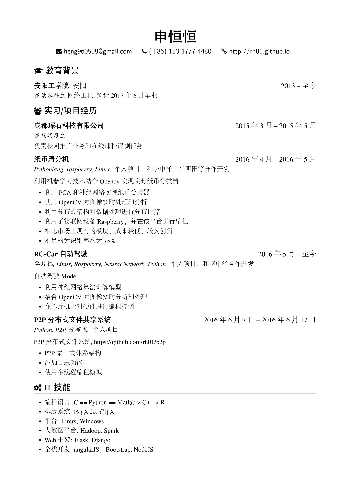
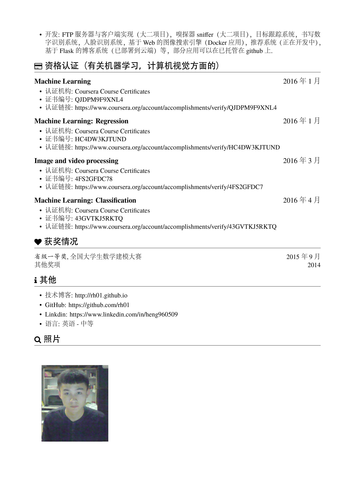

## About Me

目前研究方向主要为机器学习，深度学习以及计算机视觉。

## 简历

## 这个博客做什么？

目前正在学习C++系统编程，所以利用博客来生成和记录学习笔记，以及强大的C++的技巧.同时也会有相关的机器学习文章。

## 博客平台

这个博客通过 [Jekyll](http://jekyllrb.com/) 生成，部署在 [Github](https://pages.github.com)，主题基于 [3-Jekyll](https://github.com/P233/3-Jekyll) 修改生成，非常感谢 [Peiwen Lu](https://github.com/P233) 开发出这么漂亮的主题。

我博客的源码托管在[Github](https://github.com/rh01/rh01.github.io)上，如果有任何改进意见，欢迎讨论。
